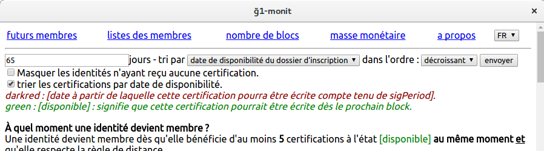

Title: Duniter version 1.3
Date: 2017-06-13
Category: Technique
Tags: release
Slug: duniter-version-1.3
Authors: cgeek
Thumbnail: /images/box.svg

La version 1.3 de Duniter est désormais [disponible au téléchargement](https://github.com/duniter/duniter/releases/tag/v1.3.8) !

## Nouveautés

### Performances

La principale caractéristique de cette nouvelle mouture est certainement la rapidité du logiciel à enregistrer de nouveaux blocs : dans la version 1.2, la synchronisation initiale était devenue particulièrement longue à mesure que la blockchain avançait. Les nœuds ARM, souvent dotés de cartes SD à faibles performances comparées à des disques durs classiques ou SSD, était particulièrement lents pour traiter des nouveaux blocs.

Désormais, la réception de nouveaux blocs ainsi que la synchronisation initiale sont jusqu'à 200 fois plus rapides qu'avant !

À titre indicatif, la synchronisation initiale prend moins de 15 minutes pour synchroniser 26.000 blocs sur un Raspberry PI 3. Elle pouvait prendre [plus de 2 jours en version 1.2](https://forum.duniter.org/t/duniter-sur-yunohost-derriere-une-box-privatrice-type-livebox/2169/30).
 
### L'arrivée des modules !

C'était une fonctionnalité [annoncée durant les RML9 au Havre](../videos-rml9) : Duniter 1.3 permettrait de brancher des modules sur son propre nœud !

A titre d'exemple, il est désormais possible d'ajouter [le plugin duniter-currency-monit](https://github.com/duniter/duniter-currency-monit/releases) à son nœud local :

</img>

Une documentation sur les modules est mise à disposition sur le [Wiki](wiki/duniter/modules/).

### Cesium n'est plus livré par défaut

Le client Cesium était historiquement livré avec Duniter. Avec l'arrivée des modules, ce choix d'installer Cesium est laissé à chacun. L'adresse du module Cesium est : 

    https://github.com/duniter/duniter-ui-cesium/archive/1.0.0.tar.gz

## Synchronisation

>  Pas besoin de resynchroniser.

## Compatibilité

>  Compatible avec la Ğ1.

-----

## Mettre à jour sa version

* Lien pour [installer la nouvelle version](https://github.com/duniter/duniter/blob/master/doc/install-a-node.md) depuis un poste vierge
* Lien pour [mettre à jour vers la nouvelle version](https://github.com/duniter/duniter/blob/master/doc/update-a-node.md) depuis une installation existante
