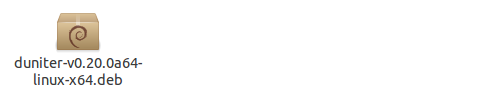
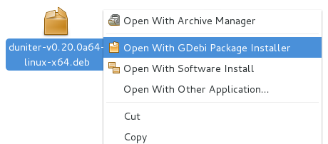
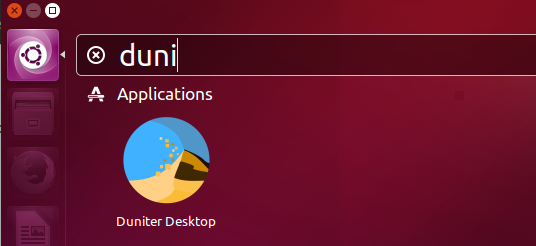
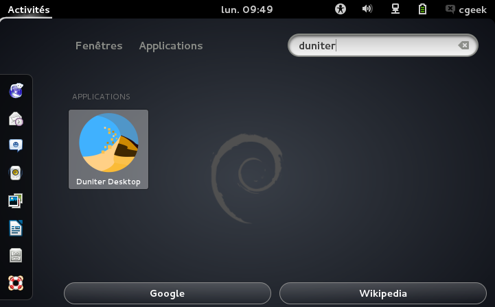
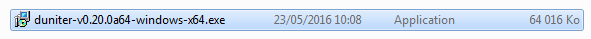
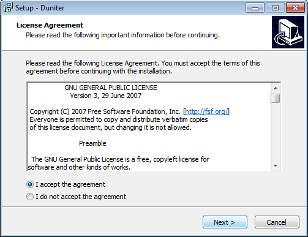
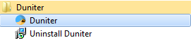

Title: Installer un nœud Duniter
Order: 9
Date: 2017-06-19
Slug: installer
Authors: cgeek

Ce document est un petit guide pour installer et déployer votre propre instance Duniter pour :

* soit participer à l'écriture de la blockchain (vous devez être membre)
* soit avoir un nœud miroir, qui réplique la blockchain et en conserve une copie

## Sommaire

* [Bureau ou serveur](#bureau-ou-serveur)
    * [Version bureau](#version-bureau)
    * [Version serveur](#version-serveur)
* [GNU/Linux](#gnulinux)
    * [Ubuntu/Debian 64 bits](#ubuntudebian-64-bits)
    * [Gentoo 64 bits](#gentoo-64-bits)
    * [YunoHost](#yunohost)
    * [Autres distributions](#autres-distributions)
    * [Docker](#docker)
    * [Compilation manuelle](#compilation-manuelle)
* [Windows](#windows)
* [MacOS](#macos)

----

# Bureau ou serveur

Il existe deux versions de Duniter. Choisissez celle qui vous convient le mieux.

## Version bureau

Une machine de bureau vous facilitera la tâche pour gérer votre instance Duniter grâce à son interface graphique.

Votre instance fonctionnera tant que votre machine et que le logiciel ne sont pas éteints. Si vous fermez le logiciel ou éteignez votre machine, Duniter sera en mesure de se resynchroniser avec le réseau une fois la machine et Duniter redémarrés.

## Version serveur

Pour les utilisateurs les plus avancés, une version _serveur_ vous permet d'avoir un nœud allumé 100% du temps, en l'installant sur une machine elle-même toujours allumée.

Vous pourrez contrôler votre instance à l'aide d'outils en ligne de commande, mais vous aurez également accès à l'interface graphique via un navigateur web.

> Lorsque vous en aurez fini avec l'installation, vous pourrez consulter [la documentation des commandes Duniter](https://duniter.org/fr/wiki/duniter/commandes/).

# GNU/Linux

## Ubuntu/Debian 64 bits

### Téléchargez le paquet

Allez sur la [page des publications](https://git.duniter.org/nodes/typescript/duniter/wikis/Releases) pour obtenir le lien vers la dernière version stable.

Choisissez le fichier qui vous concerne :

* les fichiers pour Ubuntu et Debian sont ceux qui se terminent par l'extension `.deb` ;
* pour la version _bureau_, choisissez un fichier contenant `desktop` dans son nom, pour la version _serveur_, choisissez `server` ;
* le fichier dépend également de l'architecture (ARM ou x64) ; si vous ne savez pas de quoi il s'agit, vous avez probablement besoin de la version x64.

  

### Installez Duniter

Pour procéder à l'installation :

* si vous êtes avec Ubuntu, double-cliquez sur le fichier téléchargé ;
* si vous êtes avec Debian, faites un clic droit sur le fichier téléchargé, option `GDebi`.
   
  

> Note : vous pouvez également installer le paquet en ligne de commande avec `dpkg`. Exemple :

    sudo dpkg -i duniter-*-linux-x64.deb

### Démarrez l'application

Pour démarrer la version _bureau_ :

* avec Ubuntu, utilisez le _Dash_ et cherchez _Duniter_, puis cliquez sur l'icône Duniter pour lancer le logiciel :
   
  
* avec Debian, utilisez _Gnome Shell_ et cherchez _Duniter_ puis cliquez sur son icône pour le lancer :
   
  

> Note : vous pouvez aussi lancer la version _bureau_ de Duniter avec la commande `duniter-desktop`. Lancer via cette commande ou via l'icône est équivalent.

Pour démarrer votre nœud en tâche de fond (version _serveur_), exécutez la commande :

    duniter start
        
> Consultez [les commandes Duniter](https://duniter.org/fr/wiki/duniter/commandes/) pour manipuler votre nœud serveur.

### Activez le démarrage automatique

> Le démarrage automatique n'est disponible que sur les versions _serveur_ à partir de la 1.6.15.

Pour que le nœud serveur se lance automatiquement au démarrage de la machine, tapez la commande :

    sudo systemctl enable duniter.service

Par défaut, le serveur qui va démarrer ainsi le fera en tant qu'utilisateur `duniter` dans le répertoire `/var/lib/duniter`.

Vous pouvez personnaliser le comportement du service en utilisant le principe de [drop-ins](https://coreos.com/os/docs/latest/using-systemd-drop-in-units.html). Par exemple, pour démarrer avec l'interface web, vous pouvez créer un fichier `/etc/systemd/system/duniter.service.d/10-web.conf` et y ajouter le contenu suivant :

    [Service]
    Environment="DUNITER_WEB=web"

Les variables d'environnement que vous pouvez modifier pour le service sont :

| Variable | Description |
|----------|-------------|
| `DUNITER_WEB` | Doit être vide pour un démarrage normal, ou _web_ pour démarrer l'interface web |
| `DUNITER_HOME` | L'emplacement des fichiers du serveur, par défaut : `/var/lib/duniter/.config/duniter` |
| `DUNITER_DATA` | Le nom (emplacement) de la base de données, par défaut : `duniter_default` |
| `DUNITER_OPTS` | Diverses autres options à passer à la ligne de commande lors du (re-)démarrage |

> Note : jusqu'à la version 1.6.17, `DUNITER_HOME` était par défaut égal à `/var/lib/duniter`.

Vous pouvez aussi vous inspirer de [ce mode d'emploi](https://duniter.org/fr/wiki/duniter/lancement-au-boot/) pour mieux contrôler le service Duniter.

## Gentoo 64 bits

Pour installer Duniter sur Gentoo, il existe un paquet dans la surcouche [sveyret-overlay](https://github.com/sveyret/sveyret-overlay). Un fichier _README_ se trouve dans cette surcouche pour vous aider à l'ajouter à l'arbre _Portage_.

Vous pourrez ensuite installer le paquet `net-p2p/duniter` :

    emerge -av net-p2p/duniter

Les _USE flags_ suivants permettent de contrôler ce qui va être généré :

| _Flag_ | Description |
|--------|-------------|
| `desktop` | Génère et installe la version _bureau_ au lieu de la version _serveur_ |
| `gui` | Ajoute une interface graphique (obligatoire pour la version _bureau_, ajoute l'interface web en version _serveur_) |

## YunoHost

Un [paquet YunoHost](https://github.com/duniter/duniter_ynh) est disponible (version _serveur_ uniquement).

## Autres distributions

Pour les autres distributions, il existe un fichier contenant la version _bureau_ compilée.

1. Allez sur la [page des publications](https://git.duniter.org/nodes/typescript/duniter/wikis/Releases) pour obtenir le lien vers la dernière version stable et téléchargez le fichier `duniter-desktop` qui se termine par l'extension `.tar.gz`.

2. Décompressez le fichier téléchargé, par exemple avec la commande : `tar zxvf duniter-*.tar.gz`

3. **Placez-vous dans le répertoire décompressé**, puis lancez Duniter avec la commande `./nw`.

## Docker

> Note : vous devez avoir installé Docker sur votre machine pour créer un conteneur Duniter.

> Note : seule la version _serveur_ de Duniter existe sous Docker.

Pour récupérer une image de la dernière version :

    docker pull duniter/duniter-ts

Vous pouvez ensuite créer le conteneur par la commande :

    docker run -d -p127.0.0.1:9220:9220 -p10901:10901 -p20901:20901 --name duniter duniter/duniter-ts

Sans autre option, le conteneur va automatiquement exécuter `duniter direct_webstart`. Le `-d` dans la commande permet d'exécuter l'image en tâche de fond (démon). L'option `--name` permet de donner un nom unique au conteneur qui sera ainsi plus facile à utiliser pour les commandes suivantes. Les différentes options `-p` permettent de connecter les ports du conteneur et ceux de l'hôte :

* le port 9220 est le port de l'IHM web ; préciser l'adresse IP 127.0.0.1 (localhost) permet d'empêcher un ordinateur extérieur d'accéder au paramétrage du nœud ;
* le port 10901 est utilisé pour l'accès BMA, l'export de ce port n'est donc pas nécessaire si vous n'activez pas le BMA ;
* le port 20901 est utilisé pour l'accès WS2P.

> Note : n'utilisez pas à la fois les options de démonisation de Duniter et de Docker (par exemple `docker run -d duniter/duniter-ts webstart`) sinon le conteneur s'arrêtera immédiatement.

Une fois le nœud démarré, vous pouvez y accéder soit par l'IHM web en vous connectant à l'adresse http://localhost:9220, soit en ligne de commande :

    docker exec -it duniter duniter sync g1.duniter.fr 443

Dans la commande ci-dessus, le premier `duniter` est le nom donné au conteneur lors de son démarrage, tandis que le deuxième est la commande qui sera exécutée.

Vous pouvez arrêter ou redémarrer le conteneur avec les commandes Docker standards :

    docker stop duniter
    docker start duniter

### Utilisation d'un fichier trousseau

Si un fichier est trouvé dans le conteneur à l'emplacement `/etc/duniter/keys.yml`, il est utilisé comme fichier de trousseau pour l'identité du nœud. Pour que ce fichier soit visible par Duniter, il faut lui mettre les bons droits d'accès. Si votre fichier `keys.yml` se trouve par exemple dans le répertoire `~/duniter/conf`, voici les commandes à exécuter pour qu'il soit pris en compte :

    chown -R 1111:1111 ~/duniter/conf
    chmod -R 644 ~/duniter/conf
    docker run -d -p127.0.0.1:9220:9220 -p10901:10901 -p20901:20901 --mount src=~/duniter/conf,dst=/etc/duniter --name duniter duniter/duniter-ts

> Note : certaines des commandes ci-dessus nécessitent des droits « administrateur », l'usage de `sudo` pourra être nécessaire.

### Stockage externe de la configuration

Normalement, la configuration et la base de données sont stockées dans le conteneur. Il est cependant possible de les stocker sur la machine hôte. Pour cela, il faut partager le répertoire `/var/lib/duniter`, en donnant les bons droits d'accès. Par exemple, pour que les données soient enregistrées dans le répertoire `~/duniter/data`, voici les commandes à exécuter :

    chown -R 1111:1111 ~/duniter/data
    docker run -d -p127.0.0.1:9220:9220 -p10901:10901 -p20901:20901 --mount src=~/duniter/data,dst=/var/lib/duniter --name duniter duniter/duniter-ts

> Note : certaines des commandes ci-dessus nécessitent des droits « administrateur », l'usage de `sudo` pourra être nécessaire.

## Compilation manuelle

La version _serveur_ de Duniter peut être compilée sur la majorité des machines Linux (32 bits ou 64 bits) en cinq étapes (les deux premières ne sont à réaliser qu'une seule fois) :

** Prérequis **

Vous devez disposer a minima de `git` et `build-essential`, pour les installer :

    sudo apt-get update && sudo apt-get install git build-essential

**1. Installation de Node.js**

Un outil vous permet d'installer la version de Node.js que vous souhaitez, en changer quand vous voulez et sans conflit avec une version précédente : il s'agit de [nvm](https://github.com/creationix/nvm).

Vous pouvez installer nvm avec la commande suivante :

    curl -o- https://raw.githubusercontent.com/creationix/nvm/v0.33.4/install.sh | bash
    
Fermez puis rouvrez votre terminal, comme indiqué. Puis, installez Node.js :

    nvm install 8.9.1

> Note : pour les versions antérieures à Duniter 1.6, la version de Node.js à installer est la 6.

**2. Installation de [yarn](https://yarnpkg.com/)**

Yarn est un gestionnaire de dépendances plus rapide et plus fiable que celui intégré de base dans npm, cela vous évitera des erreurs dues a des conflits de version par exemple. Le plus propre est d'ajouter leur dépôt puis d'installer le paquet `yarn` :

    curl -sS https://dl.yarnpkg.com/debian/pubkey.gpg | sudo apt-key add -
    echo "deb https://dl.yarnpkg.com/debian/ stable main" | sudo tee /etc/apt/sources.list.d/yarn.list
    sudo apt-get update && sudo apt-get install yarn

**3. Téléchargement de Duniter**

Allez sur la [page des publications](https://git.duniter.org/nodes/typescript/duniter/wikis/Releases) pour obtenir le lien vers la dernière version stable et téléchargez le fichier `Source code (tar.gz)`.

**4. Lancer l'installation depuis le dossier décompressé `duniter/` :**

> Note : **ne lancez pas ces commandes en tant que `root`.** [Cela ne fonctionnera pas, nous le savons](https://github.com/duniter/duniter/issues/412).

    cd duniter
    yarn

**5. Utiliser [les commandes Duniter](https://duniter.org/fr/wiki/duniter/commandes/)** en préfixant `duniter` par `bin/`. Exemple : 

        bin/duniter --version

**6. Rajouter l'interface web** (non présente par défaut), qui ajoute les commandes `direct_webstart` et `webstart`:

    bin/duniter plug duniter-ui@1.6.x

> Note : pour Duniter **1.5.9** ou inférieur :

    bin/duniter plug duniter-ui@1.4.x
    sed -i "s/duniter\//..\/..\/..\/..\//g" node_modules/duniter-ui/server/controller/webmin.js

# Windows

Une version _bureau_ est disponible pour Windows.

1. Allez sur la [page des publications](https://git.duniter.org/nodes/typescript/duniter/wikis/Releases) pour obtenir le lien vers la dernière version stable et téléchargez le fichier `duniter-desktop` qui se termine par l'extension `.exe`.

2. Procédez à l'installation en double-cliquant sur le fichier `.exe` téléchargé.
  

> Il se peut que le fichier téléchargé n'ai pas l'extension `.exe`. C'est Windows qui a retiré l'extension lors du téléchargement pour vous protéger. Vous pouvez contourner ce problème en renommant le fichier téléchargé et en ajoutant `.exe` à la fin du nom de fichier.

3. Suivez la procédure d'installation.
   
  

4. Duniter est maintenant installé, par défaut celui-ci est lancé à la fin de l'installation. Vous pourrez aussi le lancer via le menu "Démarrer > Programmes > Duniter > Duniter".
   
  

# MacOS

Il n'existe pas de version pour MacOS. Toutefois, vous pouvez toujours compiler la version _serveur_.
