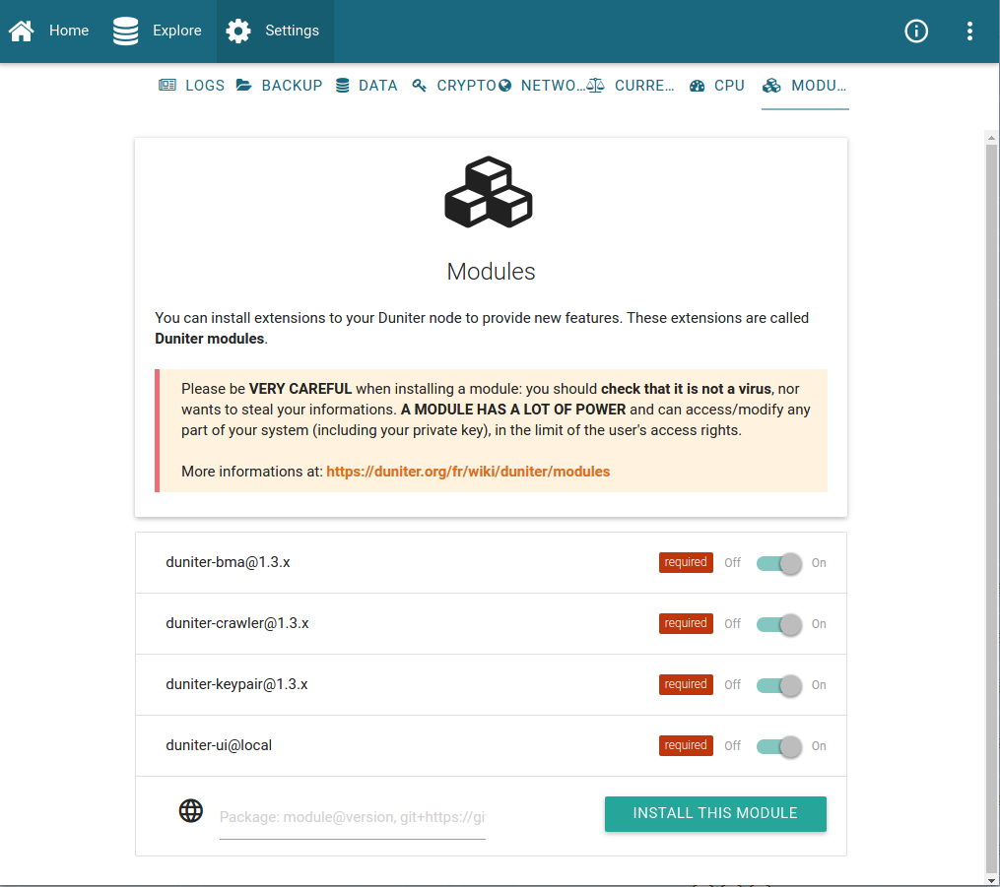
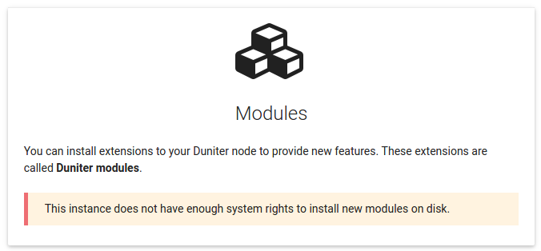
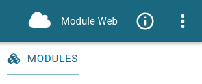
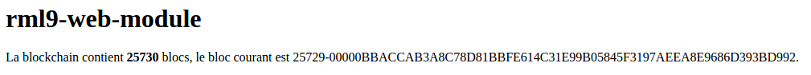

Title: Les modules
Order: 9
Date: 2017-06-09
Slug: modules
Authors: cgeek

Duniter embarque un système de chargement de *modules*. Ce système permet d'étendre les fonctionnalités de son nœud Duniter avec des portions de programme écrites par des tiers plutôt que par les développeurs du logiciel Duniter.

Cela permet au cœur de ne contenir que l'essentiel, et donne la liberté à chacun d'avoir le nœud qui lui correspond.

Une liste des modules existants est disponible sur le [wiki](./liste-modules).

## Avertissement !

Les modules *sont des programmes*, et en tant que tels ils peuvent contenir n'importe quel type de code. **Nous ne pouvons pas vous garantir qu'ils sont exempts de bugs ou de virus**.

Il est de votre responsabilité de vérifier que le module que vous installez correspond à vos attentes, notamment en termes de respect de vos données et de votre système.

Si vous ne savez pas lire le code source d'un module, [vous pouvez demander à d'autres utilisateurs leur avis](https://forum.duniter.org/c/dev/modules).

## Installer un module

Vous avez deux façon d'opérer :

* avec la ligne de commande (Duniter Server uniquement) : 

        duniter plug <module>

* avec l'interface graphique (méthode recommandée) : 

    
### Droits d'écriture

Selon votre installation, il se peut que vous ne puissiez pas installer de modules : 

En effet, pour installer un module, Duniter va devoir télécharger, ajouter et modifier des fichiers dans son répertoire d'installation. Si pendant votre exécution de Duniter vous n'avez pas assez de droits système, l'installation sera impossible et vous aurez le message ci-dessus.

Vous pouvez toutefois remédier à ce problème en accordant ces droits : 

#### Sous Linux

Une simple commande vous permet d'accorder les droits d'écriture à votre utilisateur. Exemple pour l'utilisateur `bob` :

    # chown -R bob /opt/duniter
    
Remplacez `bob` par votre utilisateur courant.

#### Sous Windows

Le plus simple est d'exécuter temporairement Duniter en mode administrateur : clic droit sur l'icône "Duniter" puis "Exécuter en tant qu'administrateur". Installez alors les modules souhaités, puis redémarrez normalement Duniter.

### Lancer l'installation

Une fois que vous avez suffisamment de droits, vous pouvez installer le module souhaité. Ceux-ci sont généralement présentés avec une adresse de téléchargement : c'est celle que vous devez copier/coller dans le champ "URL" du module, ou dans la commande `plug` si vous êtes en ligne de commande.

#### Exemple 

Vous pouvez ajouter le module d'exemple :

    duniter plug git+https://github.com/duniter/module-example.git
    
Ou dans l'interface graphique : 

Puis cliquez sur « Installer ». A la fin de la procédure, relancez votre nœud.

Vous devriez alors voir dans l'interface graphique un nouveau menu :

Vous pouvez cliquer dessus pour voir le contenu du module :

## Désinstaller un module

La désinstallation s'effectue de deux façons : 

* avec la ligne de commande (Duniter Server uniquement) : 

        duniter unplug <nom_du_module>

* avec l'interface graphique : cliquez simplement sur le bouton « On/Off ».

## Mettre à jour un module

La mise à jour est équivalente à désinstaller un module puis à le réinstaller avec une nouvelle version.
